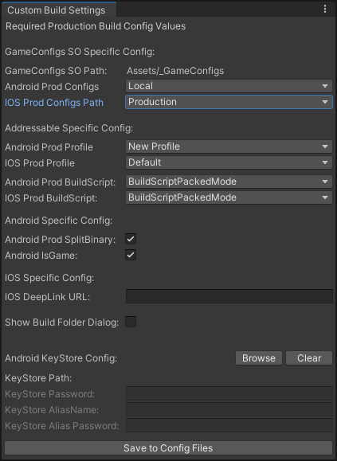
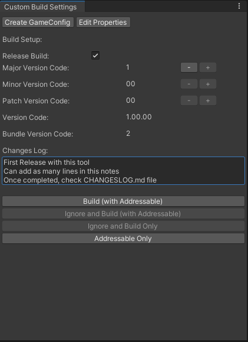
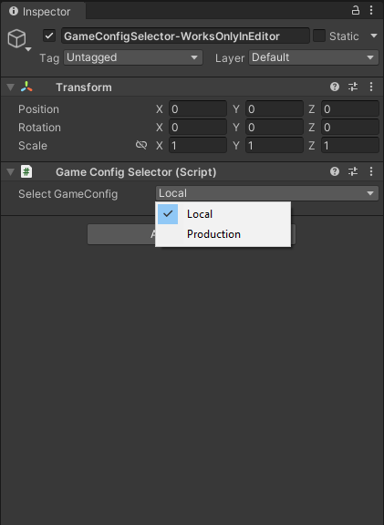
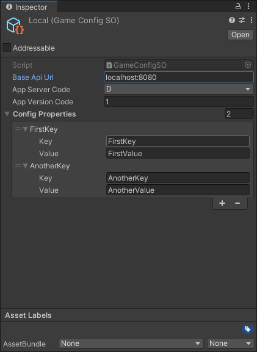
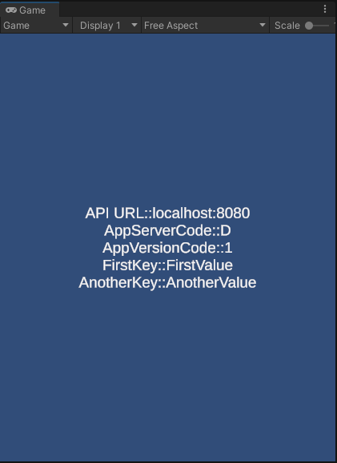

# Unity Config Build Tool
This unity plugin Automate project build for Android and IOS using pre-config propertites during pre-build, post-build and during gameplay.


## Installation
via Package Manager (**Add package from git url**):

```
https://github.com/onedevapp/ConfigBuildTool.git
```
<br>

## Why would I need this?
Ever wanted to take a production build either for Android or IOS without setting up additional work or check list to pre or post build with OneClick?, <b>Yes OneClick thats possible with this config build tool.</b> Not just production, one can take build of their choice with this tool. <br><br> <b> How it works?</b> This tool creates CustomBuildConfig.properties and Keystore.properties (Optional) in the ProjectSettings folder, where CustomBuildConfig properties file has all the production level settings and keystore properties file has production keystore properties where these properties will be used when "<b>Release Build</b>" Toggle is checked in the config build tool else options selected in the tool will be used. Available Options are

### Pre-Build
* <b>Application.version</b> - Customizable with "Major.Minor.Patch" version automate with incremental "PlayerSettings.Android.bundleVersionCode" for Android or "PlayerSettings.iOS.buildNumber" for IOS 
* <b>Changes Log</b> - Track whenever a version changes happened with mandatory changes log info about the build.
* <b>GameConfigSO</b> - A ScriptableObject file configurator for Local/Production URLs, App version code etc., can be selectable/switchable. [Read More](#On-GamePlay) 
* <b>Addressable</b> - Build Script and Profile can be selectable/ switchable
* <b>Android Specific</b> :
    * This tool builds AAB / APK
    * When "<b>Release Build</b>" selected, Split Binary option can be configurable and KeyStore properties will be mandatory
* <b>Enable Logs</b> - This tool also provide a way to remove and add logs easily with DebugX for Build. For Production this option will be disabled but for development/staging build, one can toggle it.
* <b>Show Build Folder Dialog</b> - If selected then Build save location window will shown else creates a Build Folder outside the Project Root folder and save in new folder without a prompt.

### Post-Build

For Android: 

Its just a clean up, removes keystore values from PlayerSettings. Why so? For Security purpose, keystore values are not recommended to publish through github, thats why keystore values are saved explicitly in keystore.properties files which needs to ignore at .gitignore file.

```
# Add this at .gitignore (Optional)
keystore.properties
```


For IOS:
* <b>Firebase Deeplink</b> - Deeplink URL be set automatically at ProjectCapabilityManager.AddAssociatedDomains and Info.plist where URL can be configurable at CustomBuildConfig.properties and firebase-dynamic-links-unity package was installed.
* <b>Firebase Messaging</b> - Enable ProjectCapabilityManager.AddPushNotifications when firebase-messaging-unity package was installed

</br>

### On GamePlay

<b>GameConfigSO</b> - An Editor level and Runtime Config SO with Base API Url, App Version Code where for Android its "PlayerSettings.Android.bundleVersionCode" and for IOS its "PlayerSettings.iOS.buildNumber" along with Additional Config Propertites with KeyValue Pair. 

> [!NOTE]  
> Note that GameConfigSO uses singleton instance and will be added to PreloadedAssets automatically, so no need to load SO file manually or to read from resouce folder. 

To read values at Runtime:

```C#
GameConfigSO.Instance.GetBaseApiUrl()           //Returns URL configured at SO
GameConfigSO.Instance.GetAppServerCode()        //Returns Server Code P -Prod, D -Development, S -Staging and T -Testing 
GameConfigSO.Instance.GetAppVersionCode()       //Returns App Version code
GameConfigSO.Instance.GetConfigProperty("Key")  //Returns Value based on key provided in Additional config properties
```

</br>

### Debug Logs
Replace any calls to Debug. (or UnityEngine.Debug.) with "<b>DebugX.</b>" Thats it! the arguments have been left as-is, with any additions being made as overloads, so nothing should need to change about your current project set up at all.

```C#
DebugX.Log("My Log");   //Not just Log, wrapper functions for all Unity's Debug logging calls
```

</br>

## Note:
* To make GameConfigSO works in Editor level for switchable, GameConfigSelector Script should attach to any GameObject.
* All GameConfigSO should be available only in "Assets/_GameConfigs" folder.
* KeyStore path can be Relative Path or Absolute path.
* Game Config SO and Addressable BuildScript, Profiles are platform specific in CustomBuildConfig.properties
* Other than Build, available options are 
    * Build (With Addressables) - Uses either selected or config properties
    * Ignore and Build (With Addressables) - Ignores selected properties and tires to take build with Addressables
    * Ignore and Build Only - Ignores selected properties and tires to take build
    * Addressable Only - Takes only addressable

<br>

## ScreenShots

|  |  |
| --------------------------------------- | --------------------------------------- |
|  |  |
| --------------------------------------- | --------------------------------------- |
|  |  |
<br>

## :open_hands: Contributions
Any contributions are welcome!

1. Fork it
2. Create your feature branch (git checkout -b my-new-feature)
3. Commit your changes (git commit -am 'Add some feature')
4. Push to the branch (git push origin my-new-feature)
5. Create New Pull Request

<br><br>
